---
header-includes:
  - \makeatletter\def\verbatim@font{\footnotesize\ttfamily}\makeatother
---

## Appendix C: CompLaB Studio Graphical User Interface

CompLaB Studio is the graphical user interface (GUI) for the CompLaB3D reactive transport solver. It provides an end-to-end workflow that guides the user from project creation through domain setup, chemistry and microbiology configuration, solver tuning, simulation launch, and three-dimensional post-processing of results. The GUI is built with PySide6 and runs on Windows, macOS, and Linux. This appendix walks through each panel in the order a user would encounter during a typical simulation setup, corresponding to the model tree on the left side of the main window (Figure C1).

## C.1 Main Window Layout

The main window is divided into four regions (Figure C1). On the left, a model tree lists every configuration category (Simulation Mode, Domain, Fluid/Flow, Chemistry, Microbiology, Equilibrium Chemistry, Solver Settings, I/O Settings, Parallel Execution, Run, and Post-Processing). Clicking a tree item opens the corresponding settings panel on the right. The center area hosts an embedded three-dimensional VTK viewer that displays the pore geometry and, after a simulation completes, the output fields (concentrations, velocities, biomass). A toolbar above the viewer provides controls for loading VTK files, adjusting array selection, applying threshold filters, and toggling slice planes. A message console at the bottom logs status updates, warnings, and errors throughout the workflow.

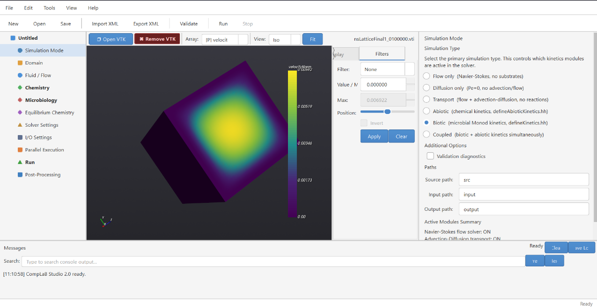

*Figure C1. Main window of CompLaB Studio. Left: model tree listing all configuration panels. Center: embedded 3D VTK viewer showing a porous medium geometry with a scalar field overlay. Right: settings panel (here showing the Simulation Mode panel). Bottom: message console.*

## C.2 Project Creation and Templates

A new project is created via File > New Project, which opens the dialog shown in Figure C2. Six templates are available, ordered by increasing physical complexity:

- Flow Only. Solves the Navier-Stokes equations on the pore geometry to produce a steady-state velocity field. No transport or reactions are included.

- Pure Diffusion. Solves the advection-diffusion equation with the Peclet number set to zero, so transport occurs by molecular diffusion alone.

- Tracer Transport (Flow + Diffusion). Combines flow and advection-diffusion transport for a passive tracer with no reactions.

- Abiotic Reaction. Adds an abiotic reaction to the tracer transport framework.

- Abiotic Equilibrium. Activates the equilibrium chemistry solver for speciation and chemical kinetic reactions.

- Biofilm. Enables the full framework: flow, transport, microbial kinetics for both sessile biofilm (modeled via cellular automaton) and planktonic bacteria (modeled via LBM), equilibrium chemistry, and biofilm growth and redistribution.

Each template pre-fills the relevant configuration fields and provides a matching C++ kinetics header file. The user specifies a project name and base directory; CompLaB Studio creates the folder structure and populates an XML configuration file. A Quick Start Guide (accessible from Help > Quick Start) lists the templates with short descriptions and outlines the step-by-step workflow (Figure C3).

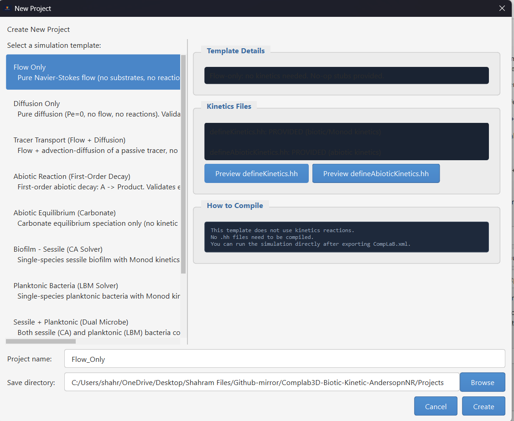

*Figure C2. New Project dialog. The user selects a template from the list on the left; the right panel shows the template description, links to the associated kinetics file, and a summary of which physics modules are activated.*

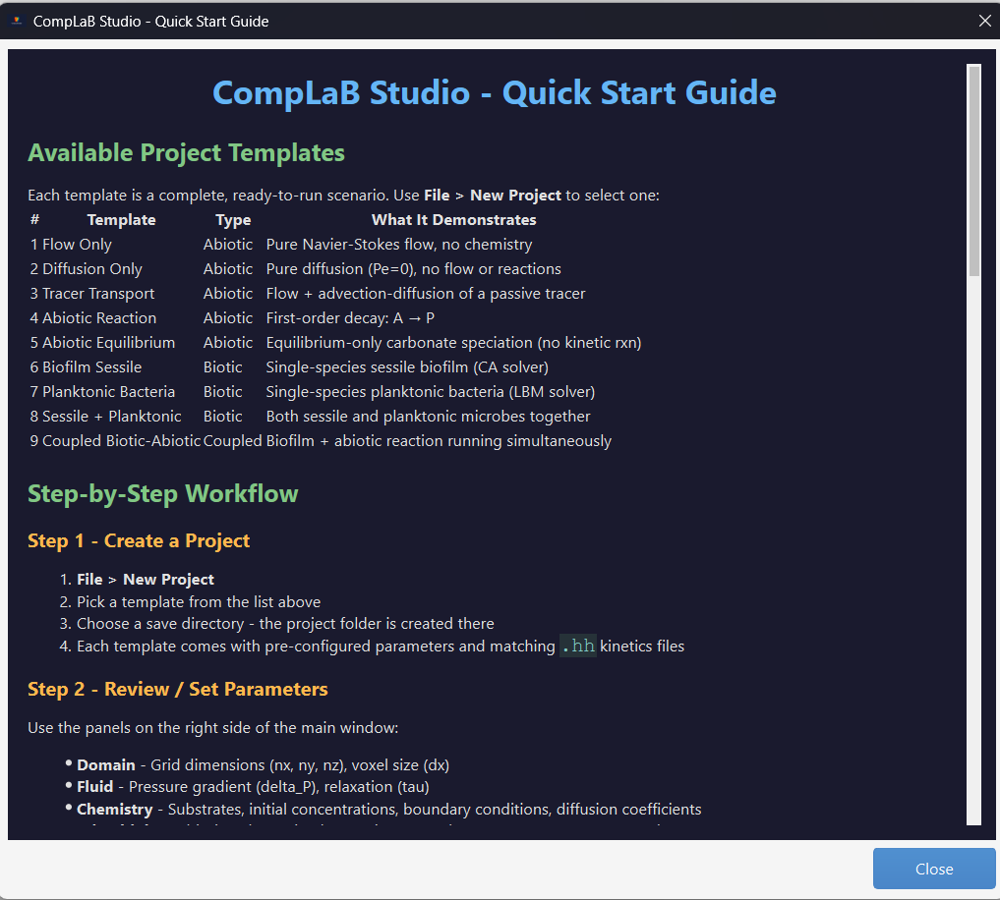

*Figure C3. Quick Start Guide dialog summarizing the available templates and the recommended step-by-step workflow for setting up a simulation.*

## C.3 Simulation Mode

The Simulation Mode panel (visible in Figure C1, right side) selects which physics modules are active in the current project. Five radio buttons correspond to progressive levels of complexity: Flow only (Navier-Stokes, no substrates), Diffusion only (Pe = 0, no advection/flow), Transport (flow + advection-diffusion, no reactions), Kinetic (microbial kinetics via user-defined rate expressions), and Coupled (microbial and chemical kinetics simultaneously). Path fields at the bottom define the source, input, and output directories used by the C++ solver.

## C.4 Domain and Geometry

The Domain panel sets the computational grid dimensions (nx, ny, nz) and the physical grid spacing (dx, dy, dz). The geometry is provided as a three-dimensional integer array in a flat text file, where each integer encodes the voxel type (pore, solid grain, biofilm, or boundary). Users can either write this file manually, import a segmented micro-CT image stack, or generate a synthetic geometry using the built-in Geometry Generator (Figure C4).

### Geometry Generator

The Geometry Generator (Tools > Geometry Generator) is a standalone dialog with three tabs (Figure C4). The Abiotic Domain tab creates porous media without biofilm using five medium types, including overlapping spheres and rectangular channels. The user sets the domain dimensions and selects the medium type; the generator produces the geometry file and optional diagnostic images (cross-sectional slices in black-and-white and color). The Sessile Biofilm tab places biofilm in user-selected spatial patterns on solid phase surfaces. The Image Converter tab imports a stack of segmented 2D images (e.g., from micro-CT scans) and converts them into the integer-coded geometry file that CompLaB3D expects, with optional biofilm overlay.

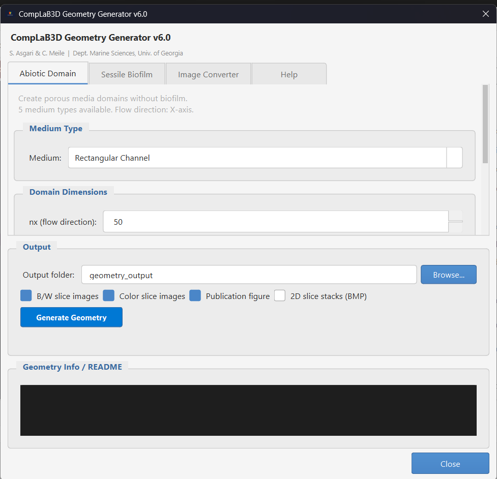

*Figure C4. Geometry Generator dialog (Abiotic Domain tab). The user selects a medium type (here: Rectangular Channel), sets domain dimensions, and chooses output options. The Sessile Biofilm and Image Converter tabs are visible but not selected.*

## C.5 Fluid / Flow Settings

The Fluid/Flow panel (Figure C5) defines the parameters for the Navier-Stokes flow solver. The primary inputs are the pressure difference between inlet and outlet (delta_P), which drives flow through the domain, the Peclet number (Pe), and the LBM relaxation time (tau). The relaxation time controls the kinematic viscosity of the fluid in lattice units. A panel at the bottom lists the LBM stability requirements: tau > 0.5, Mach number Ma < 0.3, and CFL < 1. The solver performs these checks automatically after computing the initial flow field and reports violations in the message console.

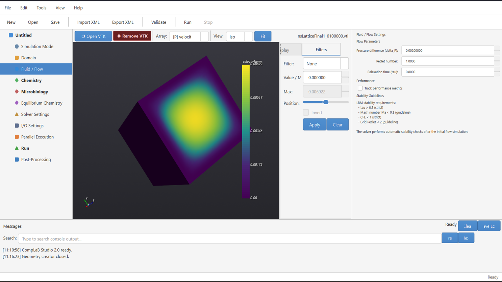

*Figure C5. Fluid/Flow settings panel. The user sets the pressure difference, Peclet number, and relaxation time. Stability guidelines are displayed at the bottom for reference.*

## C.6 Chemistry / Substrates

The Chemistry panel (Figure C6) defines the dissolved species (substrates) in the simulation. For each substrate, the user specifies a name, initial concentration, diffusion coefficient in the pore space, diffusion coefficient in the biofilm phase, and boundary conditions at the left (inlet) and right (outlet) faces of the domain. Boundary condition types include Dirichlet (fixed concentration) and Neumann (fixed flux). Multiple substrates can be added or removed using the Add and Remove buttons. The diffusion coefficients in pore and biofilm phases can differ, allowing the user to impose a reduced diffusivity within the biofilm matrix.

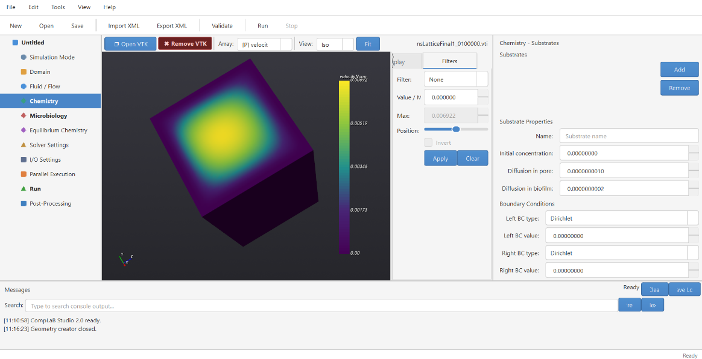

*Figure C6. Chemistry/Substrates panel. Each substrate is defined by its name, initial concentration, diffusion coefficients (pore and biofilm), and left/right boundary conditions.*

## C.7 Microbiology

The Microbiology panel (Figure C7) configures the microbial populations and their kinetic parameters. At the top, two global parameters apply to all species: the maximum biomass density (max_bMassRho), which sets the upper limit a single voxel can hold before the cellular automaton redistributes excess biomass (see Appendix B), and the threshold fraction (thrd_bFilmFrac), which determines when a voxel switches between pore and biofilm classification. A dropdown selects the CA redistribution mode (full-push or half-push; see Appendix B, Sections B.2 and B.3).

Below, individual microbial species are defined. For each species, the user provides a name, defines it as sessile or planktonic by selecting CA or LB as transport mechanism, reaction type (kinetics), material number (linking the species to its entry in the geometry file), and initial density.

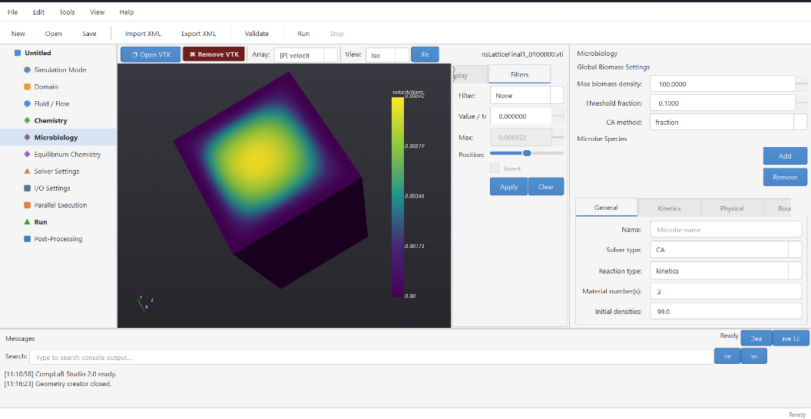

*Figure C7. Microbiology panel. Top: global biomass settings (maximum density and threshold fraction). Bottom: per-species configuration with tabs for general properties, kinetics, physical parameters, and boundary conditions.*

## C.8 Equilibrium Chemistry

The Equilibrium Chemistry panel (Figure C8) activates and configures the equilibrium speciation solver described in Appendix A. When enabled, the panel displays the mathematical formulation used by the solver: the PCF (Positive Continuous Fractions) method combined with Anderson Acceleration. The user specifies the maximum number of iterations, the convergence tolerance, the Anderson depth (number of previous iterates stored for acceleration), and the relaxation parameter (beta). Component names and substrate associations are defined here, and a button opens the stoichiometry matrix and equilibrium constant editor where the user enters the reaction network following the formulation described in Appendix A.

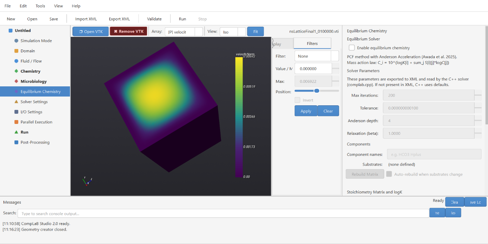

*Figure C8. Equilibrium Chemistry panel. The solver uses PCF with Anderson Acceleration. Parameters include maximum iterations, convergence tolerance, Anderson depth, and relaxation (beta). The stoichiometry matrix and log K values are defined through a dedicated editor.*

## C.9 Solver Settings

The Solver Settings panel (Figure C9) controls the iteration parameters for both the Navier-Stokes (flow) and advection-diffusion (transport) solvers. The flow solver runs in two phases: Phase 1 drives the initial flow field to steady state using a specified maximum iteration count and convergence criterion; Phase 2 is used when the flow field is recomputed after a geometry change (e.g., biofilm growth altering the pore space) and can use a different, typically tighter, convergence tolerance. An NS update interval controls how frequently the flow solver checks for convergence during the initial solve. The transport solver section sets the maximum number of ADE (advection-diffusion equation) time steps, the convergence criterion, and the ADE update interval. A Reset Settings button restores all values to their defaults.

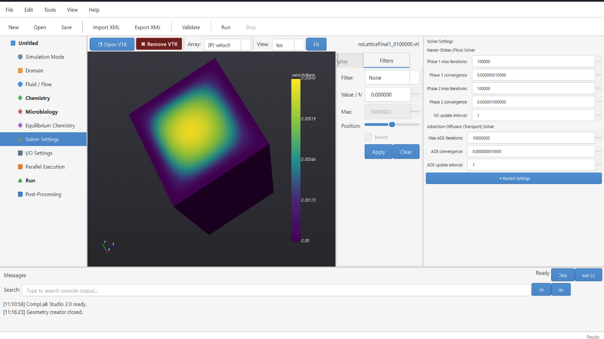

*Figure C9. Solver Settings panel. Top: Navier-Stokes (flow) solver with Phase 1 and Phase 2 convergence controls. Bottom: advection-diffusion (transport) solver iteration and convergence settings.*

## C.10 I/O Settings

The I/O Settings panel (Figure C10) manages output intervals and file naming conventions. The VTK save interval determines how often three-dimensional output files are written during the simulation (in number of time steps). A checkpoint interval controls how frequently the solver writes restart files, which allow a simulation to be resumed from an intermediate state. Restart file options let the user read previously saved Navier-Stokes and/or ADE restart files to continue an interrupted simulation. The Filenames section defines the base names for the NS lattice, mask lattice, substrate lattice, and biomass lattice output files.

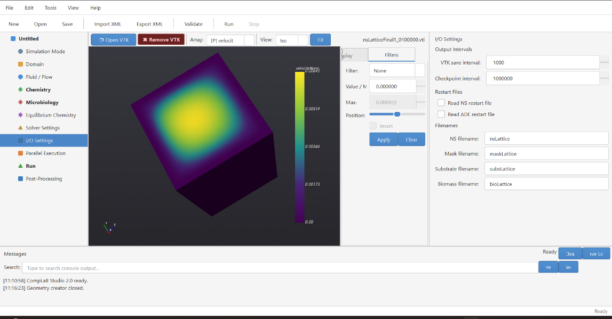

*Figure C10. I/O Settings panel. Output intervals for VTK files and checkpoint files, restart file options, and base filenames for each output lattice.*

## C.11 Parallel Execution

The Parallel Execution panel (Figure C11) configures MPI-based distributed-memory parallelism. CompLaB3D achieves parallelism through the Palabos library, which automatically decomposes the computational domain across MPI processes. The panel detects the number of available CPU threads and the installed MPI runtime (e.g., Microsoft MPI on Windows, OpenMPI on Linux/macOS). The user enables parallel execution with a checkbox and selects the desired number of threads using a slider. The MPI command field shows the detected mpiexec path and can be overridden manually. If no MPI installation is detected, the panel provides installation instructions for each operating system.

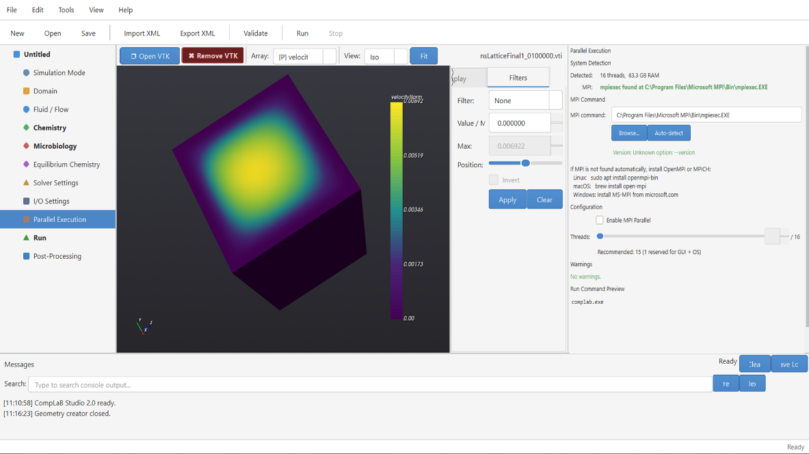

*Figure C11. Parallel Execution panel. The system detects 16 threads and locates the MPI runtime automatically. The user enables parallel execution and selects the number of processes.*

## C.12 Simulation Launch (Run)

The Run panel (Figure C12) is the final step before launching a simulation. It is organized into three tabs: Controls, Output, and Validation. The Controls tab provides two pre-run actions: Validate Configuration checks all parameters against stability criteria and physical consistency rules, reporting any issues in the message console; Export CompLaB.xml generates the XML configuration file that the C++ solver reads. The MPI/Parallel Execution section mirrors the settings from the Parallel Execution panel for quick reference. The Run Simulation button launches the solver, and a Stop button allows the user to terminate a running simulation. The Output tab shows real-time console output from the solver, and the Validation tab displays the results of the pre-flight checks.

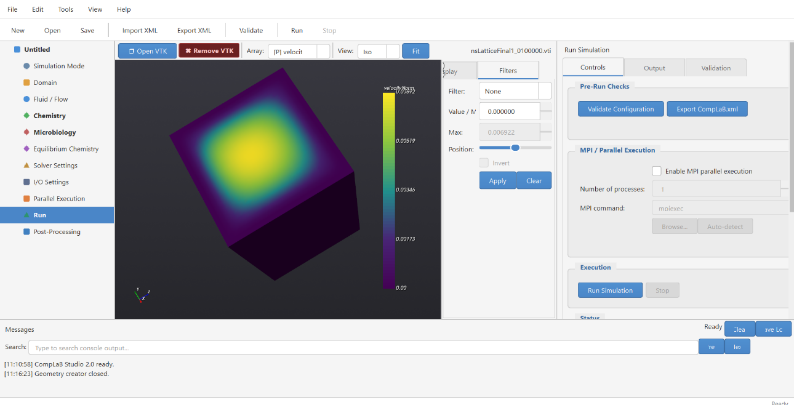

*Figure C12. Run panel (Controls tab). Pre-run validation and XML export buttons at the top, MPI configuration in the middle, and simulation launch/stop controls at the bottom.*

## C.13 Post-Processing

The Post-Processing panel (Figure C13) provides tools for visualizing simulation output. The user selects an output directory and filters for VTK files by name pattern. Output files are listed in a table, and the user can load individual files into the embedded 3D viewer or remove them. The viewer supports scalar field rendering with customizable color maps, threshold filtering to isolate specific value ranges, and slice planes for cross-sectional views. File information (dimensions, scalar ranges, time step) is displayed below the file list. The VTK viewer toolbar (visible in Figure C1) provides additional controls for array selection, value range adjustment, and camera positioning.

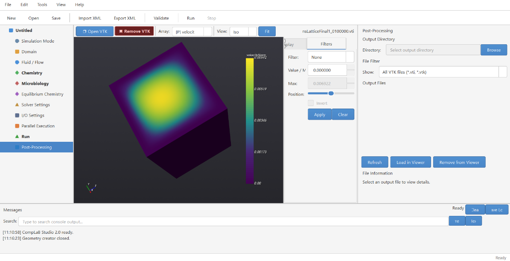

*Figure C13. Post-Processing panel. The user selects an output directory, filters VTK files, and loads them into the embedded 3D viewer for visualization.*

## C.14 Simulation and GUI Workflow Flowcharts

Figures 1 and 2 in the main paper present two flowcharts: one for the CompLaB3D simulation loop and one for the CompLaB Studio GUI workflow. This section provides additional details on both.

### C.14.1 Simulation Flowchart (Figure 1)

The simulation begins by reading the XML configuration file that defines the pore geometry, dissolved species, microbial populations, and boundary conditions. A steady-state flow field is then computed through the pore space using prescribed pressure boundary conditions, with no-slip walls enforced at solid surfaces.

The main time-stepping loop advances reactive transport through the domain. Each iteration consists of six steps. First, the collision step applies to the local transport physics at every grid cell: it uses the flow velocity and each species' diffusion coefficient to update how concentrations and suspended biomass will be advected and diffused. Boundary conditions at inlets and outlets are also enforced in this step. No mass moves between cells yet; this step only updates each cell's local state. Second, the reaction kinetics step evaluates all microbial and chemical rate expressions (growth, decay, substrate consumption) and updates concentrations and biomass densities accordingly. Third, the equilibrium chemistry step re-balances fast reactions such as acid-base speciation at every grid cell. Fourth, if biofilm is present, a cellular automaton checks whether any grid cell has exceeded its maximum biomass capacity; if so, excess biomass is redistributed to neighboring cells, potentially changing which cells are pore space and which are biofilm. Fifth, if the pore geometry has changed due to biofilm growth or decay, the flow field is recomputed to steady state on the updated geometry, producing a revised velocity field for all subsequent transport. Sixth, the streaming step moves the updated concentrations and biomass values from each cell to its direct neighbors in all three spatial directions, completing one full solve of the advection-diffusion equation for that time step.

After streaming, the solver checks whether the maximum number of time steps has been reached. If not, the loop returns to collision. If the pore geometry changed in the current iteration (step five), collision in the next iteration uses the newly recomputed flow field. If the geometry did not change, collision continues with the same flow field as before. This means that if biofilm growth narrowed a pore, the updated velocities redirect solutes accordingly in the very next iteration, delivering different concentrations to reactive surfaces and producing different reaction rates. This two-way feedback between transport, reactions, and pore geometry evolves naturally as the simulation progresses. When the final iteration is reached, output files are written containing concentration fields, biomass distributions, and velocity fields.

### C.14.2 GUI Workflow Flowchart (Figure 2)

The GUI workflow follows the model tree from top to bottom. The user begins by creating a new project and selecting a template (Section C.2), which pre-fills default values appropriate for the selected level of physical complexity. The user then configures each panel in sequence: domain geometry (C.4), fluid/flow parameters (C.5), chemistry/substrates (C.6), microbiology (C.7), equilibrium chemistry (C.8), solver settings (C.9), and I/O settings (C.10). At any point, the user can open the Geometry Generator (C.4) to create or import a pore geometry or open the Kinetics Editor to write custom rate expressions.

Once all parameters are set, the user navigates to the Run panel (C.12) and clicks Validate Configuration. The GUI checks all stability criteria (Section 3.6 of the main paper) and reports any violations in the message console. If validation passes, the user clicks Export CompLaB.xml to generate the configuration file and, if kinetics are enabled, the C++ kinetics header. The Run Simulation button compiles the code (if needed) and launches the executable with the exported configuration. During the simulation, real-time output appears in the console. When the simulation completes, the user switches to the Post-Processing panel (C.13) to visualize the output fields in the embedded 3D viewer.
