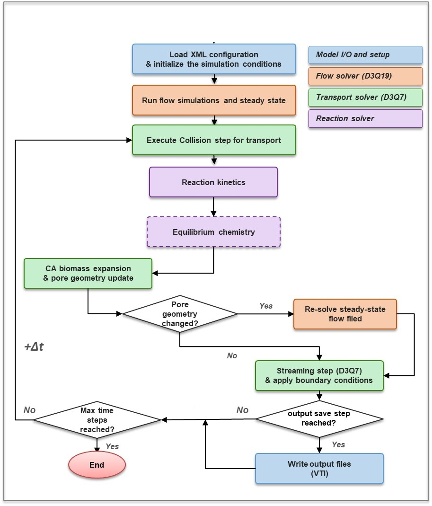
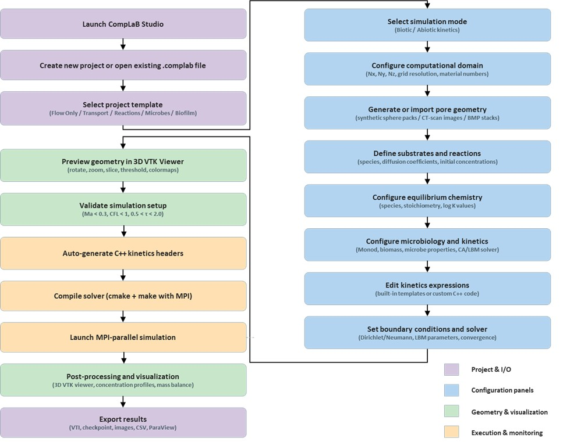

# Summary

CompLaB3D is an open-source, three-dimensional pore-scale reactive transport model that couples the simulation of Navier Stokes flow and advection-diffusion mass conservation equations with biogeochemical reactions, microbial transport and biofilm dynamics. The code uses the lattice Boltzmann method (LBM) to calculate fluid flow and advection--diffusion equations for dissolved species and planktonic microorganisms, computes rates of kinetic reactions, accounts for equilibrium reactions, tracks sessile biofilm and captures biomass redistribution using a cellular automata (CA) approach. The code is modular: flow, transport, reaction kinetics, equilibrium chemistry, and biofilm dynamics are implemented as independent components that can be enabled or disabled through the configuration file, allowing users to tailor the simulation to their specific problem. The solver is parallelized with MPI through the Palabos library [@Latt2021] using domain decomposition, allowing simulations to scale across multiple processors for large three-dimensional domains.

A graphical user interface, CompLaB Studio, provides configuration panels covering domain setup, geometry import, substrate chemistry, microbiology, boundary conditions and solver parameters. An integrated porous medium generator can create synthetic geometries or import segmented micro-CT scan images. CompLaB Studio handles code generation for user-defined rate expressions, the export of the XML configuration file and launches simulations with real-time monitoring and pre-flight checks of stability criteria. Interactive three-dimensional post-processing of VTI output files is provided through a built-in VTK viewer.

# Statement of Need

Pore-scale reactive transport modeling is essential for understanding coupled flow, transport, and biogeochemical reactions in subsurface environments [@Blunt2013; @Molins2015; @Steefel2005]. Existing pore-scale simulation frameworks lack integrated support for coupled flow, transport, biogeochemical reactions, biofilm dynamics, and equilibrium chemistry, features that are more commonly available in continuum-scale reactive transport codes such as CrunchFlow [@Steefel2015] or PFLOTRAN [@Lichtner2015], a gap that is filled by CompLaB3D. An integrated GUI makes the software accessible to a broad target audience, including researchers in subsurface biogeochemistry, geomicrobiology, and environmental engineering.

# Software design

## Fluid Flow Solver

Fluid flow is resolved on a three-dimensional lattice with 19 discrete velocity directions (D3Q19), where the evolution of distribution functions follows the standard lattice Boltzmann formulation [@He2019]:

$${\widetilde{f}}_{i}\left( \widetilde{r} + {\widetilde{c}}_{i}\Delta\widetilde{t},\widetilde{t} + \Delta\widetilde{t} \right) = \ {\widetilde{f}}_{i}\left( \widetilde{r},\widetilde{t} \right) - \frac{\Delta\widetilde{t}}{\widetilde{\tau}}\left\lbrack {\widetilde{f}}_{i}\left( \widetilde{r},\widetilde{t} \right) - {{\widetilde{f}}_{i}}^{eq}\left( \widetilde{r},\widetilde{t} \right) \right\rbrack\ \ \ \tag{1}$$

$${\widetilde{f}}_{i}^{eq} = \ {\widetilde{\omega}}_{i}\widetilde{\rho}\left\lbrack 1 + \frac{\widetilde{u}.{\widetilde{c}}_{i}}{{{\widetilde{c}}_{s,NS}}^{2}} + \ \frac{\left( \widetilde{u}{.\widetilde{c}}_{i} \right)^{2}}{4{{\widetilde{c}}_{s,NS}}^{4}} - \ \frac{\widetilde{u}.\widetilde{u}}{{{2\widetilde{c}}_{s,NS}}^{2}} \right\rbrack \tag{2}$$

where tildes denote dimensionless lattice quantities, ${\widetilde{f}}_{i}$ is the distribution function along direction $i$ at position $\widetilde{r}$ and time $\widetilde{t}$, ${\widetilde{c}}_{i}$ the lattice velocity, $\widetilde{\tau}$ the BGK relaxation time [@Bhatnagar1954], ${\widetilde{\omega}}_{i}$ the D3Q19 lattice weights, $\widetilde{\rho}$ the local fluid density, $\widetilde{u}$ the macroscopic velocity, and ${\widetilde{c}}_{s,NS} = \frac{1}{\sqrt{3}}$ the lattice speed of sound [@Kruger2017].

## Solute and Biomass Transport

Advection--diffusion of dissolved species and planktonic biomass is resolved on a D3Q7 lattice

$${{\widetilde{g}}_{i}}^{j}\left( \widetilde{r} + {\widetilde{c}}_{i}\Delta\widetilde{t},\widetilde{t} + \Delta\widetilde{t} \right) = \ {{\widetilde{g}}_{i}}^{j}\left( \widetilde{r},\widetilde{t} \right) - \frac{\Delta\widetilde{t}}{{{\widetilde{\tau}}_{g}}^{j}}\left\lbrack {{\widetilde{g}}_{i}}^{j}\left( \widetilde{r},\widetilde{t} \right) - {{\widetilde{g}}_{i}}^{j\ eq}\left( \widetilde{r},\widetilde{t} \right) \right\rbrack + {\widetilde{\Omega}}_{t}^{RXN}\left( \widetilde{r},\widetilde{t} \right)\ \tag{3}$$

$${{\widetilde{g}}_{i}}^{j\ eq}\left( \widetilde{r},\widetilde{t} \right) = {\widetilde{\omega}}_{i}{\widetilde{C}}_{j}\ \left\lbrack 1 + \frac{\widetilde{u}.{\widetilde{c}}_{i}}{{{\widetilde{c}}_{s,ADE}}^{2}} \right\rbrack \tag{4}$$

where ${{{\widetilde{\tau}}_{g}}^{j}}$ is the species-specific relaxation time, ${\widetilde{C}}_{j}$ the concentration of solute $j$, ${\widetilde{\omega}}_{i}$ the D3Q7 lattice weights, and ${\widetilde{\Omega}}_{t}^{RXN}$ the reaction source term, with lattice diffusivity $\widetilde{D} = \left( {\widetilde{\tau}}_{ADE} - 0.5 \right){{\widetilde{c}}_{s,ADE}}^{2}$ [@Kang2006].

## Reaction Kinetics

The code provides C++ header templates, *defineKinetics.hh* for biotic reactions and *defineAbioticKinetics.hh* for abiotic reactions, in which users formulate their own kinetic rate expressions using local substrate concentrations and biomass densities; the solver imposes no restriction on the form of the rate law. Each voxel is identified as either representing pore fluid, solid grain, biofilm or a domain or grain boundary and different reactions can be assigned to take place in solution, at surfaces or within biofilms:

$$X_{j}^{t + 1}\  = \ X_{j}^{t}\  + \ R_{j}\ \Delta t \tag{5}$$

where $X$ represents biomass ($B$) or chemical ($C$) concentration of state variable $j$, $R_{j}$ is the net reaction rate computed from the stoichiometric coefficients $s_{i,j}$ associated with the process rates $R_{i}$ which are updated at every time step $\Delta t$, $R_{j} = \sum_{i} s_{i,j} R_{i}$.

## Equilibrium Reactions

The effect of reactions at local equilibrium, e.g., acid-base and complexation reactions, is computed using the positive continuous fractions (PCF) method with Anderson acceleration [@Awada2025]. The mathematical formulation is given in Appendix A.

## Biofilm Growth and Redistribution

Biofilm growth and redistribution of sessile biomass are simulated using a cellular automaton (CA) approach [@Jung2023]. At each time step and biofilm voxel, biomass is updated based on the net growth rates. When the total biomass in any voxel exceeds the user-defined maximum biomass density, the excess is redistributed to neighboring voxels. Voxels are then reclassified as pore or biofilm based on whether local biomass exceeds a user-defined threshold density (a configurable fraction of the maximum biomass density). Any geometry changes triggers recomputation of the flow field (Figure 1). Pseudocode for the redistribution algorithm is provided in Appendix B.

## Stability Criteria

CompLaB3D enforces three stability criteria: the Mach number $Ma = u_{\max}/C_{s} < 0.3$, the Courant--Friedrichs--Lewy condition $CFL = u_{\max}\,\Delta t/\Delta x < 1$, and the relaxation-time bound $0.5 < \widetilde{\tau} < 2.0$. These checks are performed both by the model at startup and by the GUI validation panel, which provides immediate feedback and directs the user to the relevant configuration panel when a criterion is violated.

## CompLaB Studio: Graphical User Interface

CompLaB Studio is a cross-platform GUI built with PySide6 that provides an end-to-end workflow for configuring, running and post processing CompLaB3D simulations (Figure 2). The interface is organized into following tabbed panels:

**Project templates.** Templates of progressively more complex simulations, ranging from flow-only to the full biofilm framework with cellular automaton and geometry feedback are provided.

**Porous medium generator.** The definition of the porous media structure distribution is enabled by selecting the generation from seven medium types or the import of image stacks (micro-CT import), and the initial distribution of sessile biofilm (fourteen predefined spatial scenarios).

**Chemistry-microbiology.** The Chemistry panel defines dissolved substrates with diffusion coefficients, initial concentrations, and boundary conditions. Equilibrium speciation is configured through stoichiometric coefficients and equilibrium constants. The Microbiology panel allows for the definition of multiple microbial populations with user-defined kinetic parameters.

**Simulation launch and monitoring.** The GUI auto-generates the XML configuration file and C++ kinetics headers, compiles the code, and launches simulations with real-time monitoring of convergence.

**3D visualization.** An embedded VTK viewer renders output files with threshold filters, slice planes, and vector glyph rendering for velocity fields.

**Parallel execution.** CompLaB3D achieves distributed-memory parallelism through the Palabos library and MPI. The computational domain is automatically decomposed. The GUI provides a configuration panel for MPI launch settings.

# State of the Field

Several tools address subsets of the functionality provided by CompLaB3D. Pore-network models offer topological representations of the pore space but typically simplify flow physics. General-purpose LBM libraries such as Palabos [@Latt2021] and OpenLB [@Krause2021] supply fluid-flow and transport solvers but lack built-in support for biogeochemical reaction networks, equilibrium chemistry, and biofilm dynamics. The two-dimensional predecessor CompLaB v1.0 [@Jung2023] coupled a D2Q9/D2Q5 lattice Boltzmann engine with microbial kinetics and a cellular automaton for biofilm growth. CompLaB3D extends this framework to three dimensions (D3Q19/D3Q7), adds equilibrium chemistry and an integrated GUI with project templates, a kinetics editor and embedded three-dimensional visualization.

# Research Impact

The present work introduces the full biotic and geochemical capabilities and the CompLaB Studio interface, lowering the barrier to entry for non-specialist users.

# AI Usage Disclosure

AI language tools were used for editorial assistance. CompLaB3D source code was tested and debugged with the assistance of AI tools. AI was also used to help write inline code comments. All AI-generated content was reviewed and verified by the authors for correctness.

# Software Availability

The CompLaB3D source code reviewed for this submission (release v1.0.1, including CompLaB Studio v2.1.0) is permanently archived at Zenodo: <https://doi.org/10.5281/zenodo.19964835>. The active development repository is hosted at <https://github.com/shahram444/Complab3D-Biotic-Kinetic-AndersopnNR>.

# Acknowledgements

CompLaB3D extends the two-dimensional CompLaB v1.0 framework developed by Heewon Jung, Hyun-Seob Song, and Christof Meile [@Jung2023]; the authors thank Dr. Heewon Jung for the foundational 2-D implementation and for valuable input during the design of the 3-D extension. This work was supported by the U.S. Department of Energy, Office of Science, Office of Biological and Environmental Research, Genomic Science Program under Award Number DE-SC0022991.

# References
